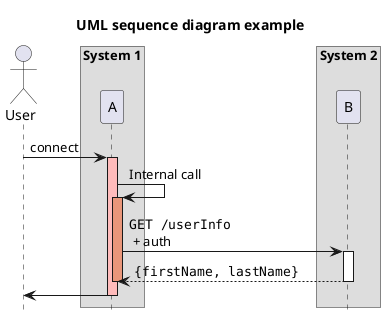

# Markdown Preview Enhanced example

[Visual Studio Code](https://code.visualstudio.com) and [Atom](https://atom.io) have a [Markdown Preview Enhanced](https://shd101wyy.github.io/markdown-preview-enhanced) extension that allows to render math & diagrams (UML, ...) inside the IDE and export as Github Flavor Markdown.

## Math

Markdown Preview Enhanced uses KaTeX or MathJax to render math expressions. 

Expression within \$...\$ will be rendered inline.

* $cos^2(\alpha) + sin^2(\alpha) = 1$
* $tan(\alpha) = \frac {sin(\alpha)} {cos(\alpha)}$

Expression within \$\$...\$\$ will be rendered in blocks.

$$cos^2(\alpha) + sin^2(\alpha) = 1$$
$$tan(\alpha) = \frac {sin(\alpha)} {cos(\alpha)}$$

See https://shd101wyy.github.io/markdown-preview-enhanced/#/math

## Diagrams

Markdown Preview Enhanced supports rendering `flow charts`, `sequence diagrams`, `mermaid`, `PlantUML`, `WaveDrom`, `GraphViz`, `Vega` & `Vega-lite`, `Ditaa diagrams`.

See https://shd101wyy.github.io/markdown-preview-enhanced/#/diagrams

## Export in Github Flavor Markdown (GFM)

Markdown Preview Enhanced supports compilation into GitHub Flavored Markdown so that the exported markdown file will include all graphs (as png images), code chunks (hide and only include results), math typesettings (show as image) etc and can be published on GitHub.
See https://shd101wyy.github.io/markdown-preview-enhanced/#/markdown

Open the MPE preview: Commande Palette (<kbd>Ctrl-Shift-P</kbd>) > Markdown Preview Enhanced: Open Preview (<kbd>Ctrl + K V</kbd>). Then, on the preview, <kbd>right-click</kbd>, `Save as markdown`

Notes: 
- Math expressions are rendered as images using the latex.codecogs.com online service: ``
- Diagrams are saved as png images to `imageFolderPath` (defaults to `/assets`). The exported image filename can be controlled by declaring {filename="your_file_name.png"}.
